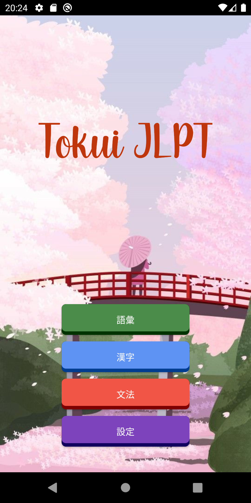
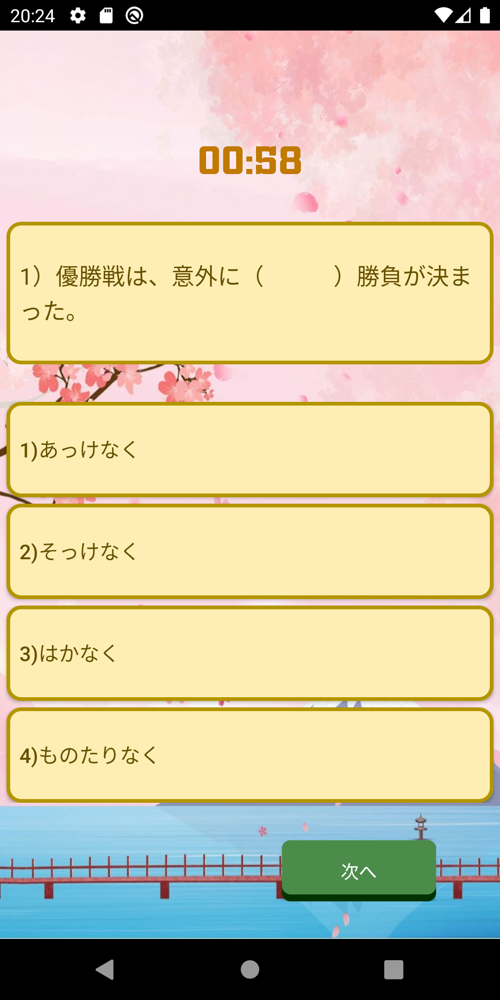
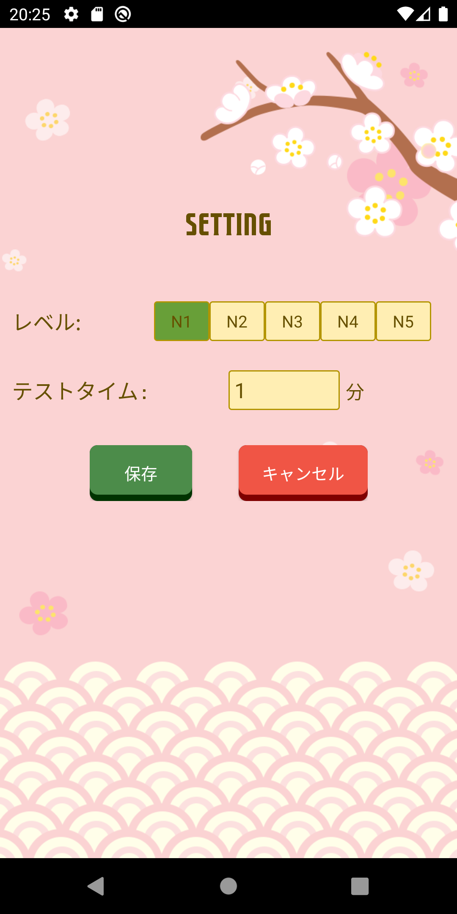

# JLPT Questions Application
## Purpose : 
I created this application for practicing Room Database

## Ideal : 
You can practice for jlpt test. There are about 7000 goi,bunpou,kanji questions.You also can setup your level and time for testing 
## Functionalities:
Some functionalities that I developed in this app:

1. Do random choosed 10 questions from  question data
2. Set up your level, time for testing (1,2,3,.. min)

## Demo:
Some images that I captured:

Main Activity            |   Question Activity
:-------------------------:|:-------------------------:
  |  

Good result           |   Bad result              |
:-------------------------:|:-------------------------:|
  |  

Setting Activity
 

## App: 
You can find <a href="https://play.google.com/store/apps/details?id=com.tokui.tokuijlptquestions"> my app</a> in CH Play